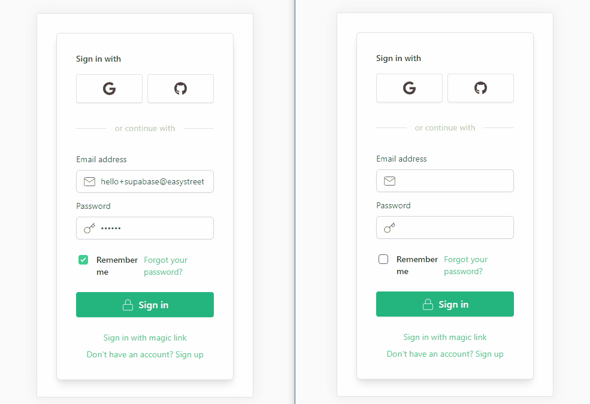

# Example: Supabase with SWR

This example shows how to use Supabase with [SWR](https://swr.vercel.app/).

## Demo

- Live demo: http://supabase-nextjs-swr.vercel.app/
- CodeSandbox: https://codesandbox.io/s/github/supabase/supabase/tree/master/examples/nextjs-swr



## Deploy your own

### 1. Create new project

Sign up to Supabase - [https://app.supabase.io](https://app.supabase.io) and create a new project. Wait for your database to start.

### 2. Database schema

Once your database has started, run this SQL query to create the required table:

```
create table pageviews (
  id bigint generated by default as identity primary key,
  inserted_at timestamp with time zone default timezone('utc'::text, now()) not null,
  ip text not null default '127.0.0.1'
);
```

### 3. Get the URL and Key

Go to the Project Settings (the cog icon), open the API tab, and find your API URL and `anon` key. You'll need these in the next step.

### 4. Deploy with Vercel

The Vercel deployment will guide you through creating a Supabase account and project. After installation of the Supabase integration, all relevant environment variables will be set up so that the project is usable immediately after deployment 🚀

[](https://vercel.com/new/git/external?repository-url=https%3A%2F%2Fgithub.com%2Fsupabase%2Fsupabase%2Ftree%2Fmaster%2Fexamples%2Fnextjs-swr&project-name=supabase-nextjs-swr&repository-name=supabase-nextjs-swr&integration-ids=oac_jUduyjQgOyzev1fjrW83NYOv)

Here, we recommend forking this repo so you can deploy through Vercel by clicking the button above. When you click the button, replace the repo URL with your fork's URL.

You will be asked for a `NEXT_PUBLIC_SUPABASE_URL` and `NEXT_PUBLIC_SUPABASE_ANON_KEY`. Use the API URL and `anon` key from [step 3](#3-get-the-url-and-key).

### 5. Change authentication settings if necessary


On [app.supabase.io](https://app.supabase.io), you can go to Authentication -> Settings to change your auth settings for your project if necessary. Here, you can change the site URL, which is used for determining where to redirect users after they confirm their email addresses or attempt to use a magic link to log in.

Here, you can also enable external oauth providers, such as Google and GitHub.

## How to use

### Download manually

Download the example:

```bash
curl https://codeload.github.com/supabase/supabase/tar.gz/master | tar -xz --strip=2 supabase-master/examples/nextjs-swr
cd nextjs-swr
```

### Using this repo

Simply clone this repo locally and proceed to the next section.

### Required configuration

Copy the `.env.local.example` file into a file named `.env.local` in the root directory of the example:

```bash
cp .env.local.example .env.local
```

Set your Supabase details from from [step 3](#3-get-the-url-and-key) above:

```bash
NEXT_PUBLIC_SUPABASE_URL=<replace-with-your-API-url>
NEXT_PUBLIC_SUPABASE_ANON_KEY=<replace-with-your-anon-key>
```

### Change authentication settings if necessary

Follow [Step #5](#5-change-authentication-settings-if-necessary) above if you want to change the auth settings.

### Run the development server

Now install the dependencies and start the development server.

```bash
npm install
npm run dev
# or
yarn
yarn dev
```

Visit http://localhost:3000 and sign up! Open another browser tab to see logged-in state and data synced between tabs. 🥳

## Authors

- [Supabase](https://supabase.io)

Supabase is open source, we'd love for you to follow along and get involved at https://github.com/supabase/supabase